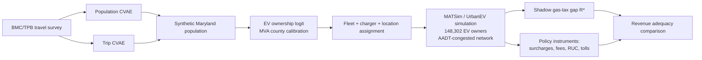

# UrbanEV-Maryland

**A generative agent-based framework for electric-vehicle charging demand and road-funding policy analysis in Maryland.**

Center for Multimodal Mobility · Department of Civil & Environmental Engineering · University of Maryland, College Park

---

## What this is

As light-duty travel electrifies, the per-gallon fuel tax that funds state roads erodes. Whether any replacement instrument — per-kWh charging surcharges, flat registration fees, distance-based road-use charges, corridor tolls — can recover the lost revenue adequately depends on jointly distributed microscopic quantities: who owns EVs, how far they drive, and where and how they charge.

This repository contains the complete modeling chain that answers that question for Maryland:



Two plain conditional variational autoencoders (CVAEs) synthesize the household population and its activity-travel demand from survey microdata. A registration-calibrated binomial logit assigns EV ownership. Vehicles, chargers, and geolocated activities are attached, and MATSim with the UrbanEV extension simulates every charging decision of Maryland's 148,302 EV owners on a network carrying observed recurring congestion. The converged baseline prices the shadow gas-tax gap (R* ≈ $33.3M/yr) and every candidate recovery instrument is evaluated on the same simulated behavior.

## Repository layout

```
pipeline/                     Python synthesis pipeline (run stages in order)
├── src/                      plain CVAE (encoder/latent/decoder, mixed heads), metrics
└── scripts/
    ├── s0_clean/             00: codebook-driven survey cleaning, dedup, imputation,
    │                             trip-feasibility filters, cleaning manifest
    ├── s1_population/        01: household CVAE training (survey-weighted ELBO)
    ├── s2_trips/             02: conditional trip CVAE, feasibility-constrained decoding
    ├── s3_ownership/         03: synthesis to MD scale
    │                         04: Burra–Cirillo ownership logit + per-county MVA
    │                             calibration (bisection on county constants)
    ├── s4_validation/        07–11: marginals (TVD), joint associations (Cramér's V),
    │                             trips, EV fleet, model comparisons
    ├── s5_geolocation/       OSM POI placement preserving CVAE-generated distances
    └── s6_plans/             06: MATSim plans + fleet build (build of record)
                              make_phev_gas_costs.py: per-archetype gasoline fallback

simulation/                   Java MATSim/UrbanEV extension (Maven, JDK 17)
├── pom.xml
├── src/                      key extensions over upstream UrbanEV:
│   │                         · per-agent income-scaled marginal utility of money
│   │                         · per-charger-type pricing + residential time-of-use
│   │                         · per-kWh road-use excise (policy lever)
│   │                         · PHEV charge-sustaining gasoline fallback (emergent
│   │                           utility factor) — scoring + discharging handlers
│   │                         · dwell-time opportunity cost (DCFC-only, by ablation)
│   │                         · free public L2 charger type (AFDC-matched)
│   │                         · MATSim roadpricing wiring for corridor/interstate tolls
└── scenarios/                run configs: baseline, 12-scenario policy sweep, tolls,
                              seed replicates (UQ), price sensitivity, 100% fleet

analysis/                     post-run analysis + publication figures (pubfig style)
                              · AADT time-variant network builder (v3: ramp/mainline
                                matching, K-factor profiles, BPR α=0.15 β=4/8)
                              · revenue frontiers (Laffer), policy ladder
                              · toll diversion mapping vs no-toll reference
                              · congestion + free-speed maps, validation panels
                              · ChargePoint occupancy panel collector + validation

docs/
├── research/                 sourcing notes: charging prices, gas-tax baseline,
│                             utility TOU tariffs, scale management
└── reports/                  methodology report (LaTeX) + verification PDFs:
                              TVD, TTI, make/model provenance, sample equivalence

reference/                    small citable lookup tables:
                              · ev_counterfactual_mpg_lookup.csv (57 archetypes,
                                per-row fueleconomy.gov URLs + retrieval dates)
                              · phev_gas_fallback_costs.csv (AAA ÷ EPA CS-mpg)
```

## Data (not included — sources and access)

Input data are excluded for size and licensing reasons. Every source is public or available by request:

| Data | Source | Role |
|---|---|---|
| BMC/TPB Regional Travel Survey 2017–18 microdata | Baltimore Metropolitan Council (data request) | CVAE training |
| MDOT MVA EV registrations by county (monthly) | [opendata.maryland.gov](https://opendata.maryland.gov) | ownership calibration targets |
| MDOT SHA AADT segments (2024) | Maryland SHA open data | congestion loading |
| AFDC station registry | [afdc.energy.gov](https://afdc.energy.gov/stations) | charger network + free-L2 shares |
| EPA vehicle specifications | [fueleconomy.gov](https://www.fueleconomy.gov) (per-row URLs in `reference/`) | batteries, consumption, counterfactual mpg |
| AAA Maryland fuel prices | [gasprices.aaa.com](https://gasprices.aaa.com/?state=MD) | PHEV gasoline fallback |
| ChargePoint occupancy panel (May 2–26, 2026; 1.76M polls, 455 stations) | collected by the authors (collector script included) | charging validation |
| Census ACS 2020–24, TIGER 2020 tracts | census.gov | independent validation, geolocation |
| OpenStreetMap Maryland extract | geofabrik.de | POIs, road network |

**Provenance note:** county×powertrain EV shares are MVA data; make/model shares *within* powertrain are estimated from 2025 U.S. sales tracking (Cox Automotive/KBB, InsideEVs) because MVA county data carry no model detail — see `docs/reports/MakeModel_Assignment_Report.pdf`.

## Reproduction

**1. Python pipeline** (Python ≥3.11; PyTorch, pandas, numpy, scipy, geopandas, matplotlib):

```bash
python -m venv .venv && source .venv/bin/activate
pip install torch pandas numpy scipy geopandas matplotlib pyarrow
# place raw data per the table above, then run stages in order:
python pipeline/scripts/s0_clean/00_clean_survey.py
python pipeline/scripts/s1_population/01_train_population_cvae.py
python pipeline/scripts/s2_trips/02_train_trip_cvae.py
python pipeline/scripts/s3_ownership/03_synthesize.py
python pipeline/scripts/s3_ownership/04_ev_ownership_cirillo.py
python pipeline/scripts/s6_plans/06_build_plans.py        # build of record (EV-only)
python pipeline/scripts/s4_validation/07_validate.py
```

**2. Simulation** (JDK 17, Maven):

```bash
cd simulation
mvn package -DskipTests -Denforcer.skip=true
java -Xmx20g -cp target/UrbanEV-Maryland-1.0-jar-with-dependencies.jar \
     se.umd.MdEVMain scenarios/config_gasfb4_baseline_25pct.xml
```

The baseline runs a deterministic 25% fleet sample (plug counts ×0.25 floor 1, flow 0.25, storage 0.25^0.75) for 50 co-evolutionary iterations; policy scenarios warm-start from the converged baseline plans. A paired full-fleet run verifies sample equivalence (`docs/reports/Sample_Equivalence_Report.pdf`).

**3. Analysis:** scripts in `analysis/` regenerate every figure and table from the run outputs.

## Headline results

| Instrument | Rate | Revenue | % of R* |
|---|---|---|---|
| Gas-tax benchmark | $0.466/gal | $33.3M | 100 |
| Public surcharge (ceiling) | +$2.00/kWh | $9.2M | 28 |
| Home surcharge at R* | +$0.12/kWh | $33.3M | 100 |
| Flat registration fee | $225/yr | $33.3M | 100 |
| Universal road-use charge | 1.6¢/mi | $33.3M | 100 |
| Interstate road-use charge | 3.0¢/mi | $31.1M | 93 |
| Corridor toll | 5.7¢/mi | $30.4M | 91 |

Public surcharges fail structurally (small, elastic base leaking to home charging and PHEV gasoline). Distance-based instruments recover the gap, losing only 4–6% of tolled VMT to diversion.

**Validation:** population TVD 0.045 (held-out survey) / 0.070 (independent ACS); Cramér's V error 0.057; trip TVDs 0.036–0.063; county fleet MAPE 3.1% (r>0.999); ChargePoint occupancy r=0.78, session starts r=0.93 (0.84 daytime); emergent PHEV utility factor 0.50–0.59 vs EPA rated 0.58; seed-replicate CVs ≤1.2% on all headline metrics.

## Citation

> Tomal, R. S., and C. Cirillo (2026). *A Generative Agent-Based Framework for Electric-Vehicle Charging Demand and Road-Funding Policy: From Conditional Variational Autoencoders to Large-Scale UrbanEV Simulation in Maryland.* TRB Annual Meeting manuscript.

Upstream components: MATSim (Horni, Nagel & Axhausen 2016) · UrbanEV extension (Adenaw & Lienkamp 2021; Parishwad, Gao & Najafi 2026) · EV ownership specification (Burra & Cirillo 2024).

## Acknowledgments

MDOT and the Baltimore Metropolitan Council for data access. Generative-AI tools assisted with code and editing; all results were verified by the authors.

## Contact

Raas Sarker Tomal — rtomal@umd.edu · ORCID 0009-0007-2607-8999
